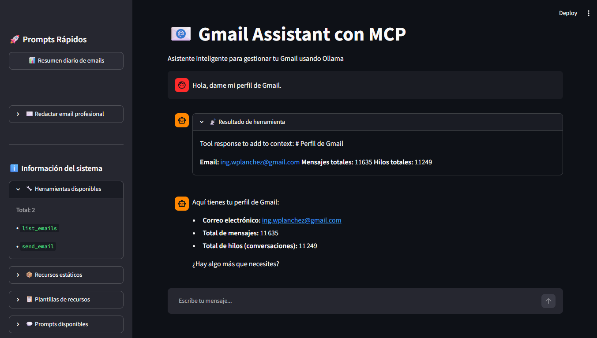
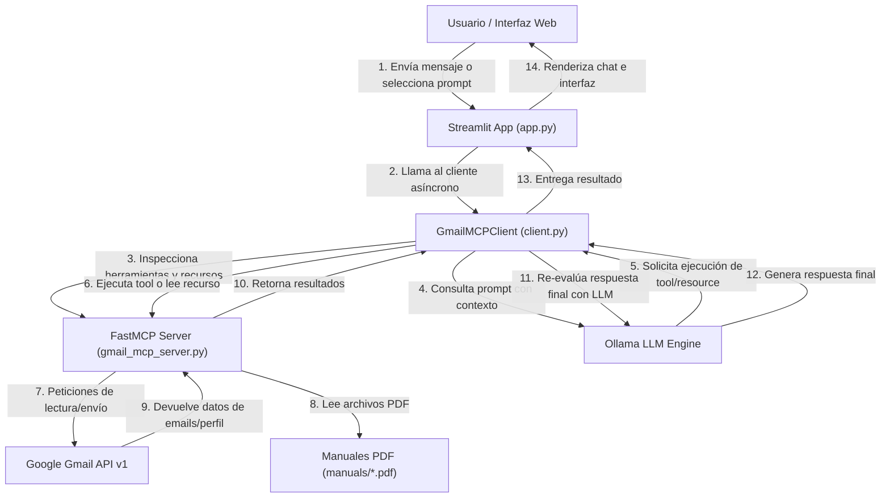

# 📧 MCP Gmail Assistant

> Asistente inteligente para la gestión integral y automatizada de Gmail utilizando el protocolo **MCP (Model Context Protocol)** impulsado por **FastMCP**, una interfaz de usuario interactiva construida con **Streamlit** y la integración de LLMs locales o en la nube a través de **Ollama**.

---

## ✨ Características Principales

- **Servidor MCP de Gmail (`gmail_mcp_server.py`):**
  - **Herramientas (Tools):** `list_emails` (listar y filtrar correos) y `send_email` (redacción y envío directo).
  - **Recursos (Resources):** `gmail://profile` para consultar metadatos del perfil de Gmail en tiempo real.
  - **Plantillas de Recursos (Resource Templates):** `docs://setup-manual/{version}` para leer dinámicamente manuales en PDF (`manual_v1.pdf`, `manual_v2.pdf`, `manual_v3.pdf`) mediante `PyPDF2`.
  - **Prompts Integrados:** Plantillas predefinidas para generación de resúmenes diarios (`daily_email_summary`) y asistencia en redacción profesional (`compose_professional_email`).
- **Cliente MCP Asíncrono (`client.py`):**
  - Conexión dinámica con el servidor MCP utilizando `fastmcp.Client`.
  - Conversión automática de herramientas y recursos MCP al esquema de llamadas a funciones de LLM (*Function Calling*).
  - Integración nativa con **Ollama** para procesamiento de lenguaje natural y toma de decisiones.
- **Interfaz Web Interactiva (`app.py`):**
  - Desarrollada con **Streamlit** con diseño responsivo.
  - Panel lateral informativo con catálogo en tiempo real de herramientas, recursos estáticos, plantillas y prompts disponibles.
  - Botones de acceso rápido para la activación de prompts y envío de datos.
  - Visualización estructurada de respuestas y salidas de herramientas mediante contenedores desplegables (*expanders*).
- **Autenticación OAuth 2.0:**
  - Integración segura con Google Gmail API usando `credentials.json` y persistencia de tokens de sesión en `token.pickle`.

---

## 📁 Estructura del Proyecto

```
mcp-gmail-assistant/
├── .env                      # Variables de entorno del proyecto
├── app.py                    # Punto de entrada de la interfaz web en Streamlit
├── client.py                 # Cliente asíncrono MCP y conector con Ollama
├── gmail_mcp_server.py       # Servidor MCP (FastMCP) para herramientas y recursos de Gmail
├── credentials.json          # Credenciales del cliente OAuth 2.0 de Google (Client Secret)
├── token.pickle              # Token de autenticación de Gmail persistido localmente
├── requirements.txt          # Dependencias y librerías de Python requeridas
├── docs/                     # Documentación técnica extendida y resúmenes de sesión
│   ├── agnostic_code.md
│   ├── client_agnostico.md
│   ├── doc_app.md
│   ├── doc_client.md
│   ├── doc_gmail_mcp_server.md
│   ├── session_summary_01.md
│   └── session_summary_02.md
└── manuals/                  # Documentos PDF de manuales de configuración
    ├── manual_v1.pdf
    ├── manual_v2.pdf
    └── manual_v3.pdf
```

---

## 🖼️ Capturas de Pantalla


**Dashboard Principal**: Vista general de la interfaz de usuario en Streamlit.



---

## 🔄 Flujo de Trabajo Lógico



### Descripción del Flujo:
1. **Interacción:** El usuario escribe un mensaje en el chat de Streamlit o hace clic en un botón de prompt rápido (ej. resumen diario).
2. **Descubrimiento MCP:** El cliente `GmailMCPClient` se conecta al servidor `gmail_mcp_server.py` para listar dinámicamente las herramientas y recursos disponibles.
3. **Inferencia LLM:** El cliente envía los mensajes junto con las definiciones de herramientas a **Ollama**.
4. **Ejecución de Herramientas / Recursos:** Si Ollama decide invocar una herramienta (como `list_emails` o `send_email`) o leer un recurso (como `gmail://profile` o `docs://setup-manual/latest`), el cliente ejecuta la llamada contra el servidor FastMCP.
5. **Integración con Servicios Externos:** El servidor MCP interactúa con la API de Gmail (OAuth 2.0) o procesa los manuales PDF en disco.
6. **Respuesta en Pantalla:** El cliente recopila el resultado y Streamlit presenta la respuesta formateada al usuario.

---

## ⚙️ Requisitos e Instalación

### Requisitos Previos

- **Python:** Versión `3.10` o superior.
- **Ollama:** Instalado y ejecutándose en local (o servidor remoto accesible).
- **Google Cloud Console:** Proyecto con la **Gmail API** habilitada y credenciales tipo *Desktop Application* exportadas como `credentials.json`.

---

### 1. Clonar el repositorio

```bash
git clone https://github.com/tu-usuario/mcp-gmail-assistant.git
cd mcp-gmail-assistant
```

---

### 2. Configurar el Entorno Virtual

**En Windows (PowerShell):**
```powershell
python -m venv venv
.\venv\Scripts\activate
```

**En Linux / macOS:**

```bash
python3 -m venv venv
source venv/bin/activate
```
*(Opcional: Si utilizas `uv` para crear el entorno virtual)*

```bash
uv venv
.\.venv\Scripts\Activate.ps1
```

---

### 3. Instalar Dependencias

```bash
pip install -r requirements.txt
```

*(Opcional: Si utilizas `uv` para una instalación ultrarrápida)*
```bash
uv pip install -r requirements.txt
```

---

### 4. Configurar Variables de Entorno

Crea o edita el archivo `.env` en la raíz del proyecto con la siguiente configuración:

| Variable | Descripción | Valor por Defecto / Ejemplo |
|---|---|---|
| `OLLAMA_MODEL` | Nombre del modelo de Ollama a utilizar | `nemotron-3-super:cloud` / `gemma4:31b-cloud` |
| `OLLAMA_HOST` | URL del servidor de Ollama | `http://localhost:11434` |
| `GOOGLE_API_KEY` | Llave de API de Google *(Opcional)* | `AQ.Ab8RN6...` |

---

### 5. Configurar Credenciales de Google Gmail

1. Descarga el archivo `credentials.json` desde Google Cloud Console.
2. Coloca `credentials.json` en la raíz del proyecto.
3. En la primera ejecución, se abrirá una ventana del navegador para autorizar el acceso a Gmail y se generará automáticamente el archivo `token.pickle`.

---

## 🚀 Ejecución en Local

### 1. Iniciar el servicio de Ollama

Asegúrate de que Ollama se esté ejecutando y que el modelo especificado en `.env` esté disponible:

```bash
ollama run nemotron-3-super:cloud
```

### 2. Iniciar la Interfaz Web con Streamlit

```bash
streamlit run app.py
```
*(Opcional: Si utilizas `uv` para ejecutar la aplicación)*
```bash
uv run streamlit run app.py
```

La aplicación se abrirá automáticamente en tu navegador en `http://localhost:8501`.

---

## 🔧 Configuración y Detalles Técnicos

### Permisos de Gmail (Scopes)

El servidor MCP utiliza los siguientes ámbitos de autorización:
- `https://www.googleapis.com/auth/gmail.readonly` (Lectura de mensajes y perfil)
- `https://www.googleapis.com/auth/gmail.send` (Envío de mensajes)

### Comandos de Desarrollo y Pruebas

| Acción | Comando |
|---|---|
| Iniciar Aplicación Web | `streamlit run app.py` (o `uv run streamlit run app.py`) |
| Ejecutar Servidor MCP (Python) | `python gmail_mcp_server.py` |
| Ejecutar Servidor MCP (FastMCP CLI) | `fastmcp run gmail_mcp_server.py` |
| Abrir Inspector Interactivo en Navegador | `fastmcp dev gmail_mcp_server.py` |
| Inspeccionar Servidor en Consola (Resumen/JSON) | `fastmcp inspect gmail_mcp_server.py` |
| Probar Cliente MCP | `python client.py` |

#### Comandos Útiles de FastMCP CLI:

1. **Abrir interfaz interactiva en el navegador (Inspector):**
   ```bash
   fastmcp dev gmail_mcp_server.py
   ```
2. **Inspeccionar la información del servidor en la consola (resumen/JSON):**
   ```bash
   fastmcp inspect gmail_mcp_server.py
   ```
3. **Ejecutar el servidor directamente:**
   ```bash
   fastmcp run gmail_mcp_server.py
   ```

---

## 📝 Cambios Recientes

- **v1.0.0 (Versión Actual):**
  - Implementación del servidor FastMCP con soporte para herramientas `list_emails` y `send_email`.
  - Integración de recurso `gmail://profile` y plantillas de recursos `docs://setup-manual/{version}` para lectura de PDFs.
  - Creación del cliente asíncrono con integración de herramientas a esquemas funcionales para Ollama.
  - Desarrollo de la interfaz gráfica interactiva con Streamlit, paneles laterales explicativos y soporte de prompts.

---

## 💡 Propuestas de Mejora

- [ ] Agregar suite de pruebas unitarias e integración (`pytest`).
- [ ] Implementar soporte multi-proveedor de IA (Google GenAI, OpenAI, Anthropic).
- [ ] Incorporar herramientas adicionales de Gmail (gestión de etiquetas, marcas de leído/no leído, borrado de emails).
- [ ] Configurar un pipeline de CI/CD con GitHub Actions.
- [ ] Dockerizar la aplicación completa (`Dockerfile` + `docker-compose.yml`).

---

*Documentación generada automáticamente. Última actualización: 25 de septiembre de 2026.*
