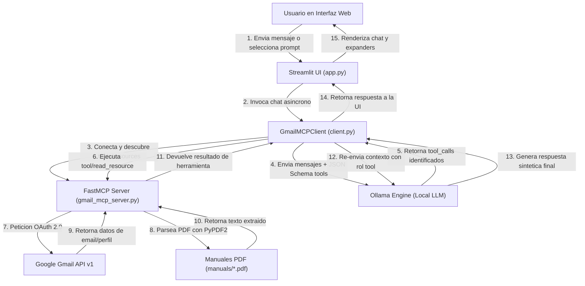

# 📄 Guía de Repaso y Preparación para Entrevistas: MCP Gmail Assistant

## 🎯 1. Problemas Resueltos y Valor de Negocio

- **Orquestación Desacoplada entre LLMs y Servicios Externos**: Tradicionalmente, integrar un modelo de lenguaje (LLM) con APIs externas de terceros (como Gmail o lectura de archivos locales) requería código *ad-hoc*, adaptadores personalizados para cada proveedor de IA y lógica rígida de llamadas. Este proyecto resuelve este desacoplamiento adoptando el **Model Context Protocol (MCP)** mediante **FastMCP**, permitiendo que las herramientas, recursos estáticos, plantillas y prompts sean expuestos de forma estandarizada y agnóstica a cualquier cliente o modelo.
- **Automatización de Flujos de Correo Electrónico sin Dependencia de Cloud Propietario**: Mitiga el riesgo de filtración de datos de correo y la dependencia de APIs cerradas al orquestar modelos de lenguaje locales/privados vía **Ollama** con el cliente asíncrono FastMCP, permitiendo resumir, buscar y redactar emails en entornos locales o de nube privada.
- **Transformación Dinámica de Recursos e Inspección en Tiempo Real**: Resuelve la rigidez en el consumo de documentación o manuales en PDF (como manuales de configuración) al servirlos dinámicamente como *Resource Templates* MCP (`docs://setup-manual/{version}`), permitiendo que el LLM inspeccione metadatos del perfil de Gmail (`gmail://profile`) o consulte PDFs en disco sin quemar contexto innecesariamente.

---

## 🏗️ 2. Arquitectura de la Solución

- **Patrón de Arquitectura:** **Client-Server MCP (Model Context Protocol) + Agentic Function Calling Cycle**. Se eligió esta arquitectura para separar completamente la responsabilidad de ejecución de herramientas/servicios de negocio (`gmail_mcp_server.py`) de la lógica de orquestación con el modelo de lenguaje (`client.py`) y de la interfaz de usuario (`app.py`).
- **Desglose de Capas:**
  - `gmail_mcp_server.py` **(Capa Servidor MCP & Integración)**: Expone las funciones ejecutables (`list_emails`, `send_email`), recursos estáticos (`gmail://profile`), plantillas dinámicas de PDF (`docs://setup-manual/{version}`) y prompts del sistema. Maneja la autenticación OAuth 2.0 de Google Gmail API.
  - `client.py` **(Capa Cliente MCP & Adaptador LLM)**: Gestiona la conexión asíncrona (`fastmcp.Client`), inspecta dinámicamente el servidor MCP, transforma recursos y herramientas al esquema JSON-Schema de *Function Calling* de Ollama/OpenAI y coordina el bucle de invocación de 2 pasos.
  - `app.py` **(Capa de Presentación / UI Streamlit)**: Interfaz interactiva para el usuario. Renderiza el panel lateral con la inspección en tiempo real del servidor MCP, botones de prompts rápidos y el componente de chat con soporte para visualización de salidas de herramientas en contenedores colapsables (`st.expander`).
  - `docs/` & `manuals/` **(Capa de Conocimiento & Documentación)**: Contiene la documentación técnica del sistema y los archivos PDF consumidos dinámicamente por la plantilla de recursos MCP.

- **Flujo de Trabajo Lógico (Mermaid):**



- **Descripción del Flujo:**
  1. El usuario interactúa con `app.py` escribiendo una instrucción o pulsando un botón de prompt (ej. *Resumen diario de emails*).
  2. `app.py` llama al método `chat()` de `GmailMCPClient` en `client.py`.
  3. El cliente se conecta asíncronamente mediante `fastmcp.Client` a `gmail_mcp_server.py` e inspecciona herramientas, recursos y plantillas disponibles.
  4. `client.py` convierte dinámicamente estos elementos a especificaciones de funciones JSON (`openai_tools`) y realiza una primera llamada HTTP a `ollama.chat()`.
  5. Si el LLM decide invocar una herramienta (ej. `list_emails` o `get_resource_gmail_profile`), Ollama retorna una estructura con `tool_calls`.
  6. El cliente MCP intercepta la llamada, distingue si es una herramienta ejecutable o un recurso/plantilla (ej. `docs://setup-manual/latest`), y la resuelve invocando `mcp.call_tool()` o `mcp.read_resource()`.
  7. El servidor FastMCP ejecuta la petición correspondiente contra la API de Gmail (usando tokens autenticados) o procesa el PDF local con `PyPDF2`.
  8. El resultado devuelto se empaqueta como un mensaje con rol `"tool"` y se envía de vuelta a Ollama en una segunda llamada para re-evaluar y generar la respuesta final estructurada en Markdown.
  9. `Streamlit` captura el historial resultante y lo renderiza de forma elegante en la interfaz de usuario.

---

## 💼 3. Ficha para Portafolio & CV (Estructura STAR)

* **S (Situación):** Se requería construir una herramienta inteligente para la gestión y asistencia automatizada de correo electrónico en Gmail que pudiera ser utilizada con modelos de lenguaje locales (Ollama) sin acoplar la lógica de integración de herramientas a un proveedor específico de IA ni exponer credenciales privadas en la nube.

* **T (Tarea):** Diseñar e implementar una arquitectura basada en el estándar **Model Context Protocol (MCP)** con **FastMCP**, creando un servidor MCP para la API de Gmail y documentos PDF, un cliente asíncrono en Python capaz de traducir capacidades MCP a esquemas de *Function Calling*, y una interfaz gráfica responsiva en **Streamlit**.

* **A (Acción):**
  - Implementé el servidor FastMCP (`gmail_mcp_server.py`) definiendo herramientas asíncronas de lectura (`list_emails`) y envío (`send_email`) con autenticación OAuth 2.0 de Google (`InstalledAppFlow`, `token.pickle`).
  - Diseñé recursos estáticos (`gmail://profile`) y una plantilla parametrizada (`docs://setup-manual/{version}`) que extrae texto de manuales PDF mediante `PyPDF2`.
  - Desarrollé en `client.py` un adaptador asíncrono dinámico que serializa herramientas y recursos MCP al esquema de llamadas a funciones de Ollama y gestiona el ciclo de interacción de 2 pasos (*two-pass agentic loop*).
  - Construí la interfaz gráfica interactiva en `app.py` utilizando Streamlit, optimizando el rendimiento mediante `@st.cache_resource` y visualizando respuestas con contenedores `st.expander`.

* **R (Resultado):** Se entregó una solución funcional, modular y 100% agnóstica que permite inspeccionar y consultar emails o manuales técnicos en tiempo real con latencias optimizadas en local, sentando una arquitectura lista para conectar cualquier otro servidor MCP o proveedor de IA.

---

## 🧠 4. Fundamentos Teóricos e Implementación Crítica

1. **Model Context Protocol (MCP) y Abstracción de FastMCP**:
   - *Fundamento*: MCP es un estándar abierto desarrollado para conectar modelos de IA con fuentes de datos y herramientas externas de manera uniforme. FastMCP abstrae la infraestructura del protocolo mediante decoradores Python (`@mcp.tool()`, `@mcp.resource()`, `@mcp.prompt()`).
   - *Implementación*: En `gmail_mcp_server.py`, las funciones decoradas declaran esquemas de tipos de datos de Python (`max_results: int = 10`, `query: str = "" -> list[dict]`). FastMCP introspecciona automáticamente las firmas de función y docstrings para generar el esquema JSON-Schema consumible por los LLMs.

2. **Bucle de Invocación Agéntica en 2 Pasos (*Two-Pass Function Calling Cycle*)**:
   - *Fundamento*: Un LLM con capacidad de *Function Calling* no ejecuta código por sí mismo; en su lugar, devuelve la intención de ejecución con parámetros serializados. El cliente debe ejecutar la llamada real en el entorno seguro y re-inyectar el resultado en el contexto del modelo.
   - *Implementación*: En `client.py` (`chat()`), se realiza la primera llamada a `ollama.chat(messages, tools=all_tools)`. Si `tool_calls` está presente, se resuelve la llamada mediante el servidor FastMCP (`call_tool` o `get_resource`), se adjunta el resultado al historial con `role: "tool"`, y se efectúa la segunda llamada a `ollama.chat()` para consolidar la respuesta final.

3. **Encapsulamiento de Recursos como Herramientas (*Resource-to-Tool Mapping*)**:
   - *Fundamento*: Los recursos MCP (URIs como `gmail://profile` o `docs://setup-manual/{version}`) representan fuentes de datos pasivas. Para que un LLM decida de forma autónoma leer un recurso durante la conversación, el cliente debe mapear la lectura del recurso a un formato de función ejecutable.
   - *Implementación*: En `client.py` (`get_resources_as_tools()`), se parsean dinámicamente las URIs y plantillas de recursos. Las plantillas con variables en llaves (ej. `{version}`) se traducen a parámetros requeridos de una función sintética, permitiendo que el LLM construya la URI adecuada al invocar la función.

4. **Gestión de Sesión y Autenticación OAuth 2.0 Persistida**:
   - *Fundamento*: Las APIs protegidas de Google requieren flujos de autorización OAuth 2.0 donde los tokens de acceso caducan y deben ser renovados con tokens de refresco (*Refresh Tokens*).
   - *Implementación*: En `gmail_mcp_server.py` (`get_gmail_service()`), se valida la existencia de `token.pickle`. Si expiró pero cuenta con `refresh_token`, se refresca automáticamente usando `Request()`. Si no existe, se dispara el flujo interactivo `InstalledAppFlow.from_client_secrets_file('credentials.json', SCOPES)` y se persisten los tokens actualizados.

5. **Manejo Asíncrono y Estado en Streamlit**:
   - *Fundamento*: Streamlit re-ejecuta todo el script de Python de arriba a abajo en cada interacción del usuario. Operaciones costosas de red o inicializaciones de clientes deben ser memorizadas para evitar fugas de memoria o reconexiones repetitivas.
   - *Implementación*: En `app.py`, se utiliza `@st.cache_resource` para instanciar `GmailMCPClient` una sola vez. La comunicación asíncrona con el cliente MCP se gestiona mediante `asyncio.run()`, asegurando que las corrutinas `async/await` se ejecuten limpiamente dentro del ciclo síncrono de Streamlit.

---

## 📚 5. Fichas de Estudio Cornell-Kwik (Preparación para Entrevistas)

### 📑 FastMCP & Model Context Protocol (MCP)

| CLAVES / PREGUNTAS DE ENTREVISTA | NOTAS Y DETALLES TÉCNICOS (Respuesta Directa) |
| :--- | :--- |
| ¿Qué es MCP y por qué usar FastMCP en Python? | MCP es un protocolo estándar cliente-servidor para exponer herramientas y datos a LLMs. FastMCP es el SDK oficial en Python que simplifica la creación de servidores MCP mediante decoradores declarativos (`@mcp.tool`, `@mcp.resource`). |
| Sintaxis o implementación patrón | `@mcp.tool()`<br>`def list_emails(query: str = "") -> list[dict]:`<br>&nbsp;&nbsp;&nbsp;&nbsp;`"""Docstring obligatorio para descripción del LLM"""` |
| ¿Qué error común previene o resuelve? | Evita acoplar el código de integración de APIs a un proveedor específico de LLM (OpenAI, Anthropic, Ollama). Si cambia el LLM, el servidor MCP permanece idéntico. |
| Consideraciones de rendimiento/escalabilidad | El servidor FastMCP puede ejecutarse mediante transporte STDIO o HTTP/SSE (Server-Sent Events), soportando múltiples clientes concurrentes de forma eficiente. |

> **📌 RESUMEN DE IMPACTO:** Usar MCP estandariza la capa de integraciones de la aplicación de IA, transformando cualquier API de software en una herramienta plug-and-play compatible con cualquier modelo de lenguaje.

#### 🧠 Análisis Creativo (Kwik Brain Framework)
- **Create (Analogía Mental):** MCP es como el puerto **USB-C** para la IA: en lugar de fabricar un cable diferente para cada cargador o dispositivo (Ollama, OpenAI, Anthropic), MCP define una ficha universal donde cualquier servidor de herramientas se conecta a cualquier cliente de IA.
- **Inquire (Duda Crítica):** *¿Por qué el docstring en una función decorada con `@mcp.tool()` es técnicamente crítico y no solo documentación de código?* **Respuesta:** FastMCP utiliza la reflexión de Python para extraer el docstring y enviarlo como el campo `description` en el JSON Schema de la herramienta. Si falta el docstring, el LLM no sabrá cuándo ni para qué invocar la herramienta.
- **Apply (Prueba de Fuego con Código):**
```python
from fastmcp import FastMCP

mcp = FastMCP("Gmail Manager")

@mcp.tool()
def send_email(to: str, subject: str, body: str) -> dict:
    """Envía un email desde la cuenta del usuario"""
    # Lógica de envío contra la API de Gmail
    return {"status": "sent", "to": to}
```

---

### 📑 Function Calling Loop & Cliente Asíncrono MCP

| CLAVES / PREGUNTAS DE ENTREVISTA | NOTAS Y DETALLES TÉCNICOS (Respuesta Directa) |
| :--- | :--- |
| ¿Cómo funciona el ciclo de llamada a funciones con Ollama/LLM? | El cliente envía los mensajes junto con las definiciones de las herramientas. El LLM responde con `tool_calls`. El cliente ejecuta las funciones en el servidor MCP, agrega el resultado al historial como `role: "tool"` y llama de nuevo al LLM para obtener el texto final. |
| Sintaxis o implementación patrón | `response = ollama.chat(model=self.ollama_model, messages=messages, tools=all_tools)`<br>`if 'tool_calls' in response['message']:`<br>&nbsp;&nbsp;&nbsp;&nbsp;`res = await client.call_tool(name, args)` |
| ¿Qué error común previene o resuelve? | Evita que el cliente devuelva al usuario un objeto JSON crudo de `tool_call` sin haber ejecutado la acción ni haber permitido al LLM interpretar la respuesta. |
| Consideraciones de rendimiento/escalabilidad | Requiere dos latencias de inferencia de LLM por interacción con herramientas (pasada de selección + pasada de síntesis final). |

> **📌 RESUMEN DE IMPACTO:** El cliente actúa como un orquestador determinista de estado, garantizando que los efectos secundarios (envío de correos, lecturas) ocurran de forma segura fuera del LLM.

#### 🧠 Análisis Creativo (Kwik Brain Framework)
- **Create (Analogía Mental):** Es como un **Mozo de Restaurante**: el cliente (usuario) pide una comida, el mozo (LLM) anota el pedido en una comanda (`tool_call`), la comanda se envía a la cocina (`FastMCP Server`), la cocina prepara el plato y el mozo se lo entrega finalmente presentado al cliente.
- **Inquire (Duda Crítica):** *Si el LLM devuelve múltiples `tool_calls` en una sola respuesta, ¿cómo debe procesarlos el cliente?* **Respuesta:** El cliente debe iterar secuencialmente o en paralelo sobre cada `tool_call`, ejecutar la herramienta MCP correspondiente para cada uno, agregar un mensaje de rol `"tool"` por cada resultado al historial y finalmente realizar la llamada de síntesis al LLM.
- **Apply (Prueba de Fuego con Código):**
```python
# Mapeo y ejecución del rol tool en client.py
messages.append({
    "role": "tool",
    "content": "Tool response to add to context: " + function_response,
    "name": function_name,
})

second_response = ollama.chat(model=self.ollama_model, messages=messages)
return second_response['message'].get('content', '')
```

---

### 📑 Recursos MCP y Plantillas Dinámicas (PDF Parsing)

| CLAVES / PREGUNTAS DE ENTREVISTA | NOTAS Y DETALLES TÉCNICOS (Respuesta Directa) |
| :--- | :--- |
| ¿Cuál es la diferencia entre un Resource y un Resource Template en MCP? | Un *Resource* es una URI estática (`gmail://profile`). Un *Resource Template* es una URI parametrizada (`docs://setup-manual/{version}`) que permite inyectar variables en tiempo de ejecución. |
| Sintaxis o implementación patrón | `@mcp.resource("docs://setup-manual/{version}")`<br>`def get_setup_manual(version: str = "latest") -> str:` |
| ¿Qué error común previene o resuelve? | Previene tener que cargar manuales gigantescos o documentación completa en el prompt de sistema. Los recursos se leen *On-Demand* solo cuando el LLM lo requiere. |
| Consideraciones de rendimiento/escalabilidad | Lectura eficiente de archivos locales con `PyPDF2`, extrayendo metadatos y texto plano dinámicamente según la versión solicitada. |

> **📌 RESUMEN DE IMPACTO:** Las plantillas de recursos permiten exponer sistemas de archivos o bases de conocimiento dinámicas al LLM mediante URIs semánticas estandarizadas.

#### 🧠 Análisis Creativo (Kwik Brain Framework)
- **Create (Analogía Mental):** Un Resource es como escribir la dirección fija de una casa en el GPS, mientras que un Resource Template es como una **URL con parámetros de consulta (`?version=v3`)** que genera dinámicamente la página requerida.
- **Inquire (Duda Crítica):** *¿Cómo hace el cliente en `client.py` para permitir que el LLM decida leer una plantilla de recursos si Ollama solo entiende definiciones de tipo `function`?* **Respuesta:** El cliente realiza una inspección del esquema de la plantilla (usando expresiones regulares como `re.findall(r'\{(\w+)\}', uri_template)`), construye una especificación de función sintética con esos parámetros y, al ejecutarse, reconstruye la URI final sustituyendo los argumentos antes de invocar `read_resource()`.
- **Apply (Prueba de Fuego con Código):**
```python
# Extracción de texto PDF en gmail_mcp_server.py
with open(pdf_path, 'rb') as file:
    pdf_reader = PyPDF2.PdfReader(file)
    text_content = [page.extract_text() for page in pdf_reader.pages]
    return f"# Manual {version.upper()}\n\n" + "\n\n".join(text_content)
```

---

## 🛠️ 6. Flujo de Desarrollo Recomendado (Blueprint)

Paso a paso para construir un proyecto de automatización MCP + LLM desde cero:

```text
[Fase 1: Configuración de Entorno e Integración de Terceros]
 ├── 1. Inicializar repositorio Git y virtualenv (`python -m venv .venv` o `uv venv`).
 ├── 2. Configurar credenciales OAuth 2.0 en Google Cloud Console (Gmail API).
 └── 3. Crear `.env` para `OLLAMA_MODEL`, `OLLAMA_HOST` y claves de API.

[Fase 2: Desarrollo del Servidor FastMCP (gmail_mcp_server.py)]
 ├── 4. Instanciar `FastMCP("Gmail Manager")`.
 ├── 5. Crear la función de autenticación `get_gmail_service()` con persistencia en `token.pickle`.
 ├── 6. Implementar herramientas `@mcp.tool()`: `list_emails` y `send_email`.
 ├── 7. Definir recurso estático `@mcp.resource("gmail://profile")`.
 ├── 8. Crear plantilla `@mcp.resource("docs://setup-manual/{version}")` integrando `PyPDF2`.
 └── 9. Probar el servidor de forma aislada usando `fastmcp dev gmail_mcp_server.py`.

[Fase 3: Desarrollo del Cliente MCP Asíncrono (client.py)]
 ├── 10. Implementar `GmailMCPClient` con conexión asíncrona `Client(mcp_server_path)`.
 ├── 11. Crear `get_tools_for_llm()` y `get_resources_as_tools()` para mapear MCP a JSON Schema.
 └── 12. Desarrollar el método `chat()` con el bucle de invocación de 2 pasos de Ollama.

[Fase 4: Desarrollo de la Interfaz Web (app.py)]
 ├── 13. Configurar la página de Streamlit (`st.set_page_config`).
 ├── 14. Memorizar la instancia del cliente con `@st.cache_resource`.
 ├── 15. Construir la barra lateral (`st.sidebar`) con inspección dinámica del servidor MCP.
 ├── 16. Implementar la interfaz de chat con `st.chat_input` y `st.chat_message`.
 └── 17. Formatear las salidas de herramientas y recursos usando `st.expander`.

[Fase 5: Verificación, Pruebas y Despliegue]
 ├── 18. Ejecutar `python -m py_compile *.py` para verificación atómica de sintaxis.
 ├── 19. Probar flujo end-to-end ejecutando `streamlit run app.py`.
 └── 20. Asegurar `.gitignore` para prevenir la subida de `credentials.json`, `token.pickle` y `.env`.
```
