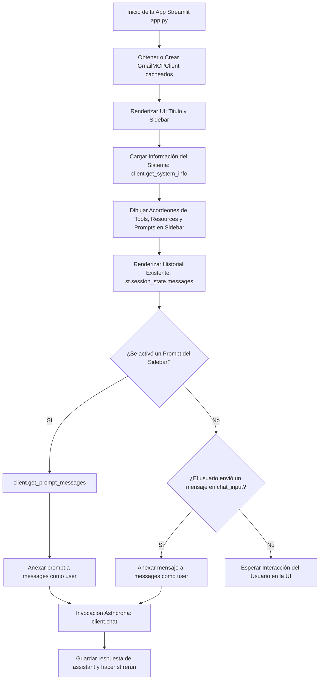

# Documentación Detallada: `app.py`

## 🧠 Fundamentos Necesarios
- **Streamlit Framework:** Librería de Python para crear aplicaciones web interactivas orientadas a datos. Utiliza un modelo de re-ejecución del script (*rerun*) desde la primera hasta la última línea ante cada interacción del usuario.
- **Manejo de Estado de Sesión (`st.session_state`):** Mecanismo de persistencia de variables clave entre recargas/re-ejecuciones del script de Streamlit (ej. historial de chat `messages`, selección de prompts `use_prompt`).
- **Integración Asíncrona con `asyncio.run()`:** Ejecución sincrónica de funciones asíncronas de Python (`async def`) desde una interfaz web sincrónica como Streamlit para interactuar con el cliente MCP.
- **Cache de Recursos (`@st.cache_resource`):** Decorador de Streamlit para instanciar globalmente objetos pesados o de larga duración (como `GmailMCPClient`) de forma única en memoria a lo largo de las sesiones.
- **Componentes Nativos de Chat:** Uso de `st.chat_message()` y `st.chat_input()` para renderizar burbujas de diálogo conversacionales y capturar la entrada del usuario.

---

## Librerias importadas y dependencias
- `streamlit`: Construcción de la interfaz gráfica web (UI/UX), widgets de la barra lateral, historial de chat y cajas de mensajes.
- `client.GmailMCPClient`: Importación de la clase cliente definida en [`client.py`](./doc_client.md) encargada de la comunicación con el servidor MCP y Ollama.
- `asyncio`: Módulo estándar de Python utilizado para invocar métodos asíncronos (`client.get_system_info()`, `client.get_prompt_messages()`, `client.chat()`) de forma bloqueante mediante `asyncio.run()`.

---

## 🛠️ Desglose de Componentes

| Tipo / Elemento | Nombre / Identificador | Descripción Breve |
|---|---|---|
| **Configuración de Página** | `st.set_page_config()` | Establece el título de la pestaña, ícono y distribución de pantalla ancha. |
| **Función Cacheadas** | `get_client()` | Instancia e inicializa la clase `GmailMCPClient` una sola vez en memoria. |
| **Sección Sidebar** | `with st.sidebar:` | Barra lateral que contiene accesos rápidos a Prompts y el panel de Información del Sistema MCP. |
| **Variable de Estado** | `st.session_state.messages` | Lista que almacena el historial completo de mensajes (`user`, `assistant`, `tool`). |
| **Función Auxiliar UI** | `display_message()` | Detecta si un mensaje es de tipo `tool` o contiene encabezados Markdown para formatearlo en acordeones desplegables (`st.expander`). |
| **Bucle de Renderizado** | `for msg in st.session_state.messages:` | Reconstruye y dibuja en pantalla el historial de conversación en cada ciclo de re-ejecución. |
| **Bloque de Prompt** | `if "use_prompt" in st.session_state:` | Procesa y dispara la ejecución cuando el usuario selecciona un prompt predefinido desde la barra lateral. |
| **Input del Usuario** | `if prompt := st.chat_input():` | Captura la entrada de texto por teclado en el chat principal, invoca al cliente y refresca la UI. |

---

## 🛠️ Análisis Detallado de Componentes

### **`get_client()`** *(Decorada con `@st.cache_resource`)*
- **Propósito:** Mantener un singleton del cliente `GmailMCPClient` reutilizable entre todas las interacciones de la aplicación.
- **Parámetros:** Ninguno.
- **Retorno:** Instancia de `GmailMCPClient`.
- **Lógica Interna:** Streamlit ejecuta esta función en la primera carga y almacena en caché la referencia devuelta, evitando crear múltiples instancias del cliente en cada interacción.

---

### **`Sidebar (Barra Lateral)`**
- **Propósito:** Ofrecer un panel de control interactivo para seleccionar accesos rápidos a Prompts y visualizar el estado del servidor MCP.
- **Componentes:**
  1. **Botonera de Prompts:**
     - Botón `"Resumen diario de emails"`: Asigna `"daily_email_summary"` a `st.session_state.use_prompt`.
     - Desplegable `"Redactar email profesional"`: Captura `recipient` y `subject` con `st.text_input` y dispara la clave `"compose_professional_email"`.
  2. **Información del Sistema MCP:**
     - Ejecuta `asyncio.run(client.get_system_info())`.
     - Organiza las capacidades en cuatro acordeones (`st.expander`):
       - 🔧 Herramientas disponibles (`info['tools']`)
       - 📦 Recursos estáticos (`info['resources']`)
       - 📋 Plantillas de recursos (`info['templates']`)
       - 💬 Prompts disponibles (`info['prompts']`)

---

### **`display_message(content: str, role: str = "assistant")`**
- **Propósito:** Analizar dinámicamente la estructura del contenido devuelto por el servidor MCP o el LLM para renderizarlo con la jerarquía visual adecuada.
- **Parámetros:**
  - `content` (`str`): Texto del mensaje a renderizar.
  - `role` (`str`, opcional): Rol del emisor (`"user"`, `"assistant"`, `"tool"`).
- **Retorno:** `None` (dibuja directamente en el flujo de la UI de Streamlit).
- **Lógica Interna:**
  1. Si `content` está vacío o es nulo, finaliza sin dibujar nada.
  2. Si `role == "tool"`: Extrae si la primera línea contiene un encabezado Markdown `# ` para usarlo como título del desplegable `st.expander("📡 ...")` y muestra el resto dentro del acordeón.
  3. Si `role == "assistant"` o `"user"` y las primeras líneas inician con `# `: Asume que es el resultado de un recurso MCP formateado y lo envuelve en un desplegable `st.expander("📄 ...")`.
  4. De lo contrario, renderiza el texto plano en Markdown convencional (`st.markdown(content)`).

---

### **`Historial de Conversación y Bucle de Renderizado`**
- **Propósito:** Garantizar que los mensajes anteriores permanezcan visibles en pantalla en cada *rerun* de Streamlit.
- **Lógica Interna:**
  - Inicializa `st.session_state.messages = []` si no existe.
  - Itera la lista `st.session_state.messages`:
    - Para respuestas de tipo `"tool"`, dibuja la burbuja de asistente `with st.chat_message("assistant")` e invoca `display_message(role="tool")`.
    - Omite mensajes de asistente vacíos (mensajes intermedios que solo contenían `tool_calls`).
    - Para mensajes de `"user"` y `"assistant"`, usa `with st.chat_message(role)` invocando `display_message()`.

---

### **`Manejador de Prompts Seleccionados (`st.session_state.use_prompt`)`**
- **Propósito:** Cargar la plantilla de un prompt MCP seleccionado desde el Sidebar y desencadenar automáticamente la respuesta del LLM.
- **Lógica Interna:**
  1. Elimina `use_prompt` y `prompt_params` de la sesión mediante `.pop()`.
  2. Invoca asíncronamente `client.get_prompt_messages(prompt_name, **params)`.
  3. Anexa el texto del prompt recuperado a `st.session_state.messages` como mensaje de usuario y lo dibuja en pantalla.
  4. Ejecuta `asyncio.run(client.chat(st.session_state.messages))` dentro de un indicador de carga `st.spinner("Pensando...")`.
  5. Anexa la respuesta del asistente a la sesión si no está vacía.
  6. Llama a `st.rerun()` para refrescar la interfaz de forma limpia.

---

### **`Manejador de Entrada por Chat (`st.chat_input`)`**
- **Propósito:** Capturar mensajes escritos libremente por el usuario en la caja de texto principal.
- **Lógica Interna:**
  1. Al presionar *Enter*, anexa la cadena ingresada como `{"role": "user", "content": prompt}`.
  2. Muestra el mensaje del usuario en la interfaz.
  3. Invoca asíncronamente `asyncio.run(client.chat(st.session_state.messages))`.
  4. Muestra la respuesta devuelta por el cliente MCP.
  5. Guarda la respuesta en `st.session_state.messages` y fuerza una recarga con `st.rerun()`.

---

## 🔄 Flujo de Trabajo Lógico (End-to-End)

### Diagrama de Flujo (Mermaid graph TD)

### Descripción del Flujo
1. **Paso 1 (Inicialización de UI y Cliente):** Streamlit ejecuta `app.py`, configura la página web y obtiene el cliente singleton de `GmailMCPClient`.
2. **Paso 2 (Descubrimiento en Sidebar):** Se consulta asíncronamente `client.get_system_info()` para poblar los acordeones desplegables de la barra lateral con las capacidades detectadas en el servidor MCP.
3. **Paso 3 (Reconstrucción de Pantalla):** Se itera la lista `st.session_state.messages` pasando cada elemento por la función inteligente de formateo `display_message()`.
4. **Paso 4 (Procesamiento de Eventos):**
   - Si el usuario hizo clic en un prompt predefinido, se extrae la plantilla con `get_prompt_messages()` y se dispara la conversación con `client.chat()`.
   - Si el usuario escribió una consulta libre en `st.chat_input()`, se agrega la entrada y se invoca directamente `client.chat()`.
5. **Paso 5 (Actualización y Rerun):** La respuesta devuelta por el cliente (tras ejecutar herramientas o recursos internamente) se almacena en el estado de sesión y se fuerza la recarga limpia de la pantalla con `st.rerun()`.

---

## Informacion adicional complementaria o notas

* **Fix de Compatibilidad Aplicado:** En versiones previas, el bloque de prompts accedía a `prompt_msg["content"]["text"]` asumiendo que `get_prompt_messages()` retornaba un diccionario. Al actualizar el servidor a FastMCP v2, `get_prompt_messages()` devuelve una cadena de texto directa (`str`), por lo que en `app.py` se actualizó para pasar la variable `prompt_msg` de forma directa, eliminando el error `TypeError: string indices must be integers`.
* **Optimización de Renderizado:** La función `display_message()` evita crear burbujas de diálogo vacías en la pantalla cuando el modelo responde con mensajes intermedios que únicamente contienen `tool_calls` sin texto explicativo.
* **Manejo de Errores en Event Loop:** Al ejecutar `asyncio.run()` dentro de un entorno web sincrónico como Streamlit, se debe asegurar que el subproceso o cliente maneje correctamente la vida del *loop* asíncrono para evitar advertencias de *loop congelado* o de cierre inesperado de sockets.
