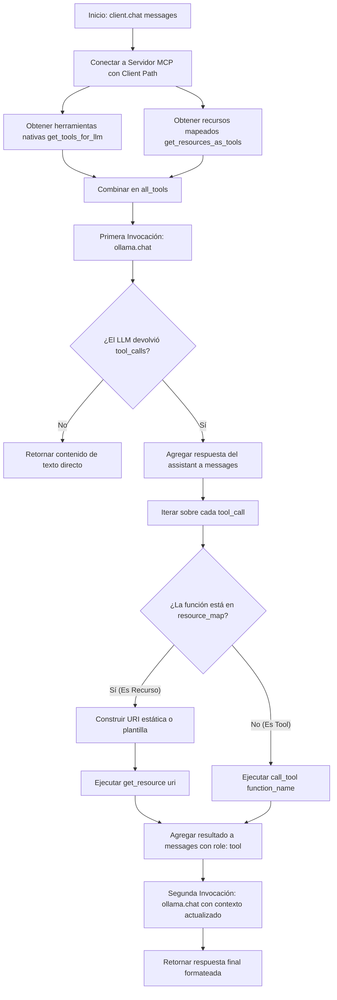

# Documentación Detallada: `client.py`

## 🧠 Fundamentos Necesarios
- **Model Context Protocol (MCP) Client:** Cliente asíncrono que se conecta a un servidor MCP (vía Stdio) para descubrir e invocar sus herramientas (`tools`), leer recursos estáticos/plantillas (`resources` / `resource templates`) y obtener sugerencias de prompts (`prompts`).
- **Asincronía en Python (`async/await`):** Uso de bucles de eventos asíncronos y gestores de contexto asíncronos (`async with`) para comunicarse de forma no bloqueante con el subproceso del servidor MCP.
- **Function Calling / Tool Calling (OpenAI Spec):** Estructuración de herramientas en esquemas JSON (`type: function`) compatibles con los modelos LLM, permitiendo que el modelo decida de forma autónoma cuándo y cómo invocar funciones externas.
- **Dynamic Resource Mapping (Bridging):** Mapeo de recursos y plantillas de recursos MCP para exponerlos hacia el LLM como si fueran funciones ejecutables (`get_resource_*`), convirtiendo las peticiones del LLM en lecturas de recursos URI.
- **Manejo de Variables de Entorno (`dotenv`):** Carga de configuración del servidor y modelo desde archivos `.env` locales mediante `load_dotenv()`.

---

## Librerias importadas y dependencias
- `fastmcp.Client`: Cliente oficial del framework FastMCP para establecer conexiones Stdio con servidores MCP.
- `pathlib.Path`: Manipulación orientada a objetos de rutas del sistema de archivos (necesario en FastMCP v2+ para especificar la ruta del servidor).
- `ollama`: Librería oficial de Python para conectar con el motor de inferencia local/cloud de Ollama y ejecutar llamadas de chat con soporte de herramientas.
- `dotenv.load_dotenv`: Carga variables de entorno almacenadas en el archivo `.env` al entorno de ejecución de Python.
- `os`: Acceso a variables de entorno (`os.getenv`) y rutas del sistema.
- `re`: Expresiones regulares utilizadas en `get_resources_as_tools()` para parsear los parámetros dinámicos de las plantillas URI (`{param}`).

---

## 🛠️ Desglose de Componentes

| Tipo / Elemento | Nombre / Identificador | Descripción Breve |
|---|---|---|
| **Clase Principal** | `GmailMCPClient` | Orquestador de la interacción entre el modelo Ollama y el servidor MCP de Gmail. |
| **Método Privado** | `_get_mcp_client()` | Crea y retorna la instancia del cliente `fastmcp.Client` usando `pathlib.Path`. |
| **Método Asíncrono** | `get_system_info()` | Lista y devuelve todas las herramientas, recursos, plantillas y prompts disponibles en el servidor. |
| **Método Asíncrono** | `get_tools_for_llm()` | Obtiene la lista de tools MCP y las convierte al formato de herramientas de OpenAI. |
| **Método Asíncrono** | `get_resources_as_tools()` | Convierte recursos y plantillas MCP en herramientas sintéticas llamables por el LLM. |
| **Método Asíncrono** | `get_prompt_messages()` | Solicita y extrae el texto plano del prompt predefinido desde el servidor MCP. |
| **Método Asíncrono** | `call_tool()` | Ejecuta una herramienta MCP en el servidor y extrae el texto devuelto. |
| **Método Asíncrono** | `get_resource()` | Lee el contenido de una URI de recurso en el servidor MCP. |
| **Método Asíncrono** | `chat()` | Ejecuta el ciclo completo de conversación en 2 pasos (LLM $\rightarrow$ Tool Calling $\rightarrow$ LLM final). |

---

## 🛠️ Análisis Detallado de Componentes

### **`__init__()`**
- **Propósito:** Inicializar las configuraciones básicas del cliente de Gmail y Ollama.
- **Parámetros:** Ninguno (`self`).
- **Retorno:** Instancia de `GmailMCPClient`.
- **Lógica Interna:**
  - Carga variables de entorno con `load_dotenv()`.
  - Establece `self.ollama_model` desde `OLLAMA_MODEL` (valor por defecto: `"gemma4:31b-cloud"`).
  - Establece `self.ollama_host` desde `OLLAMA_HOST` (valor por defecto: `"http://localhost:11434"`).
  - Define `self.mcp_server_path` apuntando al script `gmail_mcp_server.py`.

---

### **`_get_mcp_client()`**
- **Propósito:** Instanciar el objeto `Client` de FastMCP de forma asíncrona.
- **Parámetros:** Ninguno.
- **Retorno:** `Client` instanciado con `Path(self.mcp_server_path)`.
- **Lógica Interna:** Convierte la ruta de string a `pathlib.Path` para evitar la advertencia de deprecación en FastMCP v2+ y retorna el cliente listo para usar con el administrador de contexto `async with`.

---

### **`get_system_info() -> dict`**
- **Propósito:** Obtener una radiografía completa de todas las capacidades registradas en el servidor MCP.
- **Parámetros:** Ninguno.
- **Retorno:** Diccionario con las listas de nombres de `tools`, `resources`, `templates`, `prompts` y la ruta del servidor.
- **Lógica Interna:**
  - Abre conexión con `async with await self._get_mcp_client()`.
  - Ejecuta secuencialmente `list_tools()`, `list_resources()`, `list_resource_templates()` y `list_prompts()`.
  - Retorna un diccionario formateado con las listas extraídas.

---

### **`get_tools_for_llm()`**
- **Propósito:** Consultar las herramientas nativas del servidor MCP y traducirlas al formato normalizado de Function Calling.
- **Parámetros:** Ninguno.
- **Retorno:** Tupla `(openai_tools: list[dict], cliente: Client)`.
- **Lógica Interna:**
  - Para cada herramienta retornada por `list_tools()`, construye la estructura JSON:
    ```python
    {
        "type": "function",
        "function": {
            "name": tool.name,
            "description": tool.description or "",
            "parameters": tool.input_schema  # Usando snake_case compatible con MCP SDK v2
        }
    }
    ```
  - Mantiene abierta la sesión del cliente y la retorna junto a la lista.

---

### **`get_resources_as_tools()`**
- **Propósito:** Mapear los recursos estáticos y las plantillas de recursos MCP para exponerlos como herramientas invocables por el LLM.
- **Parámetros:** Ninguno.
- **Retorno:** Tupla `(resource_tools: list[dict], resource_map: dict)`.
- **Lógica Interna:**
  1. **Recursos Estáticos:** Para cada recurso en `list_resources()`, crea un nombre de función sintético `get_resource_<uri_sanitizada>` y guarda la URI asociada en `resource_map`.
  2. **Resource Templates:** Para cada plantilla en `list_resource_templates()`, utiliza expresiones regulares `re.findall(r'\{(\w+)\}', uri_template)` para detectar los parámetros entre llaves `{}`. Crea un esquema JSON con dichos parámetros requeridos y mapea la plantilla en `resource_map`.

---

### **`get_prompt_messages(prompt_name: str, **kwargs) -> str`**
- **Propósito:** Obtener la plantilla de texto plano de un prompt predefinido registrado en el servidor MCP.
- **Parámetros:**
  - `prompt_name` (`str`): Nombre del prompt a solicitar (ej. `"daily_email_summary"`).
  - `**kwargs`: Argumentos dinámicos del prompt (ej. `recipient="Juan"`).
- **Retorno:** `str` conteniendo el texto del prompt.
- **Lógica Interna:**
  - Ejecuta `prompt = await cliente.get_prompt(prompt_name, arguments=kwargs)`.
  - Retorna el texto plano almacenado en `prompt.messages[0].content.text`.

---

### **`call_tool(tool_name: str, arguments: dict, client)` y `get_resource(uri: str, client)`**
- **Propósito:** Ejecutar herramientas directas o leer recursos en el servidor MCP pasándole la sesión activa.
- **Parámetros:** Nombre/URI, argumentos de entrada y la instancia de cliente MCP activa.
- **Retorno:** Cadena de texto resultante del contenido ejecutado o leído.
- **Lógica Interna:** Inspeccionan los atributos del resultado (`result.content[0].text` o `result[0].content`) para extraer y devolver la respuesta como string seguro.

---

### **`chat(messages: list) -> str`**
- **Propósito:** Ejecutar el flujo conversacional principal con Ollama, gestionando el ciclo de vida de herramientas y recursos MCP.
- **Parámetros:**
  - `messages` (`list[dict]`): Historial de conversación en formato estándar de mensajes.
- **Retorno:** `str` con la respuesta final producida por el asistente.
- **Lógica Interna:**
  1. Conecta con el servidor MCP y combina herramientas nativas y herramientas basadas en recursos (`all_tools`).
  2. Realiza la primera llamada a `ollama.chat(model=self.ollama_model, messages=messages, tools=all_tools)`.
  3. Si no hay `tool_calls` en la respuesta del modelo, retorna el texto directamente.
  4. Si hay `tool_calls`:
     - Agrega la respuesta parcial del asistente al historial `messages`.
     - Recorre cada `tool_call` e identifica si corresponde a un recurso mapeado (`resource_map`) o a una herramienta estándar.
     - Invoca `get_resource()` o `call_tool()` según corresponda.
     - Agrega el resultado devuelto al historial como un mensaje con `role: "tool"`.
  5. Ejecuta la segunda llamada a `ollama.chat(model=self.ollama_model, messages=messages)` pasando el historial actualizado.
  6. Retorna la respuesta final generada por el LLM.

---

## 🔄 Flujo de Trabajo Lógico (End-to-End)

### Diagrama de Flujo (Mermaid graph TD)



### Descripción del Flujo
1. **Paso 1 (Inicialización y descubrimiento):** Al llamar a `chat()`, se establece la conexión Stdio con `gmail_mcp_server.py` y se descubren tanto las herramientas nativas como los recursos expuestos.
2. **Paso 2 (Formateo unificado):** Se convierte toda la capacidad del servidor (herramientas y recursos) a una sola lista de funciones compatibles con el formato de herramientas de OpenAI/Ollama (`all_tools`).
3. **Paso 3 (Inferencia primaria):** Se envía la consulta inicial a Ollama. El modelo evalúa si la intención del usuario requiere información de Gmail o de los manuales.
4. **Paso 4 (Ejecución de herramientas/recursos):** Si Ollama emite una o más llamadas a funciones, `GmailMCPClient` las intercepta, determina si debe leer una URI de recurso o ejecutar una Tool, y resuelve la petición en el servidor MCP.
5. **Paso 5 (Re-inferencia y cierre):** Los resultados se anexan al historial como respuestas de tipo `tool` y se realiza una segunda llamada a Ollama para sintetizar la respuesta final en lenguaje natural para el usuario.

---

## Informacion adicional complementaria o notas

* **Compatibilidad con MCP SDK v2:**
  - El uso de `tool.input_schema` y `template.uri_template` en minúsculas con guion bajo (`snake_case`) es obligatorio en MCP SDK v2; las propiedades en `camelCase` (`inputSchema`, `uriTemplate`) generan advertencias de deprecación.
  - La instanciación de `Client(Path(filepath))` con un objeto `Path` reemplaza el uso de cadenas simples para evitar advertencias de inferencia de transporte en FastMCP.
* **Seguridad (Eliminación de `eval()`):** Las versiones previas del cliente utilizaban `eval()` para procesar la salida del prompt. Se reemplazó por la lectura directa de `prompt.messages[0].content.text`, eliminado vulnerabilidades de ejecución remota de código (RCE).
* **Limitación actual en bucle de herramientas:** En el método `chat()`, el bucle `for tool_call in tool_calls` procesa las herramientas y ejecuta la segunda llamada a `ollama.chat` retornando en la primera iteración del bucle final. Si el modelo devuelve múltiples llamadas a herramientas independientes en paralelo, se podría optimizar para acumular todas las respuestas antes de la segunda llamada al LLM.
