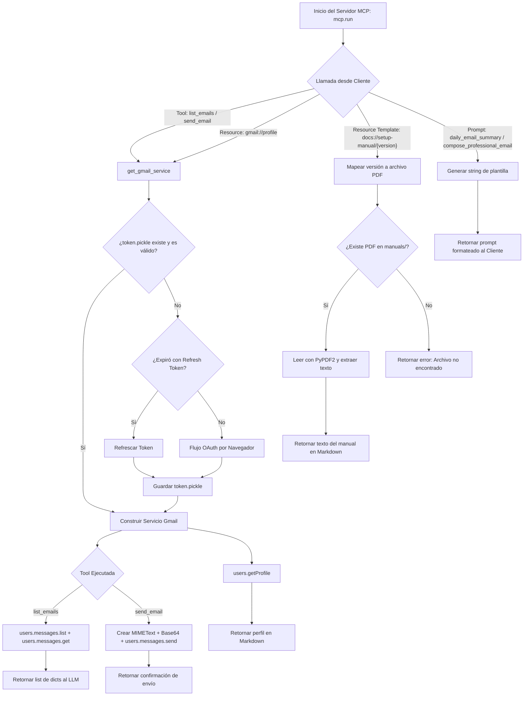

# Documentación Detallada: `gmail_mcp_server.py`

## 🧠 Fundamentos Necesarios
- **Model Context Protocol (MCP):** Arquitectura cliente-servidor abierta creada por Anthropic para proporcionar herramientas (Tools), recursos (Resources), plantillas de recursos (Resource Templates) y sugerencias (Prompts) a los modelos de lenguaje (LLMs).
- **FastMCP Framework:** Abstracción en Python basada en Pydantic y Typer para definir servidores MCP mediante decoradores de Python (`@mcp.tool()`, `@mcp.resource()`, `@mcp.prompt()`).
- **OAuth 2.0 y Google Authentication Flow:** Flujo de autenticación para acceso de usuarios de Gmail utilizando archivos de credenciales cliente (`credentials.json`), tokens persistentes (`token.pickle`) y refresco automático de tokens caducados (`google-auth-oauthlib`).
- **Google API Client Library:** Cliente dinámico de Google (`googleapiclient.discovery.build`) para realizar llamadas REST a los endpoints de la API v1 de Gmail.
- **MIME & Base64 Encoding:** Construcción de mensajes de correo electrónico estructurados con el estándar MIME (`MIMEText`) y su codificación en Base64 URL-Safe para transmisión mediante la API de Google.

---

## Librerias importadas y dependencias
- `fastmcp.FastMCP`: Framework para la creación y gestión del servidor MCP (`Gmail Manager`), exponiendo herramientas, recursos y prompts.
- `google_auth_oauthlib.flow.InstalledAppFlow`: Administra el flujo de autenticación OAuth 2.0 interactivo por navegador para aplicaciones de escritorio.
- `google.auth.transport.requests.Request`: Transporte HTTP usado para refrescar tokens OAuth 2.0 expirados.
- `googleapiclient.discovery.build`: Construye la instancia del cliente del servicio de Google Gmail (v1).
- `base64`: Codifica el contenido del correo electrónico a formato URL-safe Base64 para el parámetro `raw` de la API de Gmail.
- `email.mime.text.MIMEText`: Crea la estructura del mensaje de correo en texto plano en formato RFC 2822.
- `os.path`: Operaciones del sistema de archivos para verificar existencia de tokens, rutas de manuales en PDF y directorios.
- `pickle`: Serialización y deserialización binaria de las credenciales OAuth 2.0 (`token.pickle`).
- `PyPDF2`: Lectura y extracción del contenido en texto de archivos PDF de configuración (`manual_v1.pdf`, etc.) dentro de la función del recurso.

---

## 🛠️ Desglose de Componentes

| Tipo / Elemento | Nombre / Identificador | Descripción Breve |
|---|---|---|
| **Constante Global** | `SCOPES` | Permisos requeridos de Google OAuth (`gmail.readonly`, `gmail.send`). |
| **Instancia MCP** | `mcp` | Servidor FastMCP nombrado "Gmail Manager". |
| **Función Auxiliar** | `get_gmail_service()` | Autentica y retorna la instancia del cliente `build('gmail', 'v1', ...)`. |
| **Tool (Herramienta)** | `list_emails()` | Busca y lista correos de Gmail según una consulta `q` y límite `max_results`. |
| **Tool (Herramienta)** | `send_email()` | Construye, codifica y envía un correo electrónico a un destinatario. |
| **Resource (Recurso)** | `get_profile()` | Retorna información estática en Markdown sobre la cuenta (`gmail://profile`). |
| **Resource Template** | `get_setup_manual()` | Lee y extrae el texto de manuales PDF según la versión (`docs://setup-manual/{version}`). |
| **Prompt** | `daily_email_summary()` | Plantilla predefinida para solicitar un resumen ejecutivo diario de correos. |
| **Prompt** | `compose_professional_email()` | Plantilla con instrucciones estructuradas para redactar correos profesionales. |

---

## 🛠️ Análisis Detallado de Componentes

### **`get_gmail_service()`**
- **Propósito:** Autenticar al usuario contra los servidores de Google y retornar el cliente de la API de Gmail.
- **Parámetros:** Ninguno.
- **Retorno:** Instancia del servicio `Resource` de Google API Client (`gmail v1`).
- **Lógica Interna:**
  1. Comprueba si existe el archivo `token.pickle`. Si existe, deserializa las credenciales guardadas.
  2. Si no existen credenciales válidas o expiraron:
     - Si el token expiró pero posee `refresh_token`, ejecuta `creds.refresh(Request())`.
     - Si no hay token previo, inicia el flujo de login por navegador con `InstalledAppFlow.from_client_secrets_file('credentials.json', SCOPES)`.
  3. Guarda/actualiza las credenciales obtenidas en `token.pickle` usando `pickle.dump()`.
  4. Retorna la conexión `build('gmail', 'v1', credentials=creds)`.

---

### **`list_emails(max_results: int = 10, query: str = "") -> list[dict]`**
- **Propósito:** Exponer la capacidad de consultar correos electrónicos de Gmail al LLM mediante el servidor MCP.
- **Parámetros:**
  - `max_results` (`int`, opcional): Cantidad máxima de mensajes a listar (por defecto 10).
  - `query` (`str`, opcional): Filtro de búsqueda avanzado con sintaxis nativa de Gmail (ej. `"is:unread"`, `"from:boss@company.com"`).
- **Retorno:** `list[dict]` conteniendo lista de diccionarios con las llaves `id`, `subject`, `from` y `snippet`.
- **Lógica Interna:**
  1. Solicita el cliente de servicio con `get_gmail_service()`.
  2. Ejecuta `service.users().messages().list(userId='me', maxResults=max_results, q=query)`.
  3. Recorre la lista de IDs de mensajes devueltos. Para cada ID, consulta el detalle con `service.users().messages().get(userId='me', id=msg['id'])`.
  4. Extrae las cabeceras `Subject` y `From` inspeccionando la lista `payload['headers']`.
  5. Construye y retorna la lista resumida.

---

### **`send_email(to: str, subject: str, body: str) -> dict`**
- **Propósito:** Enviar correos electrónicos en texto plano desde la cuenta autenticada.
- **Parámetros:**
  - `to` (`str`): Dirección de correo del destinatario.
  - `subject` (`str`): Asunto del mensaje.
  - `body` (`str`): Cuerpo del mensaje en texto plano.
- **Retorno:** `dict` con estado (`status`: `'sent'`), `message_id`, `to` y `subject`.
- **Lógica Interna:**
  1. Instancia `MIMEText(body)` y asigna los encabezados `['to']` y `['subject']`.
  2. Convierte el objeto MIME a bytes (`as_bytes()`) y lo codifica usando `base64.urlsafe_b64encode().decode()`.
  3. Invoca la API de envío de Gmail: `service.users().messages().send(userId='me', body={'raw': raw}).execute()`.
  4. Retorna un diccionario confirmando el envío y entregando el ID otorgado por Google.

---

### **`get_profile() -> str`** *(Resource `@mcp.resource("gmail://profile")`)*
- **Propósito:** Exponer datos del perfil de la cuenta de Gmail asociada como un recurso accesible para el LLM.
- **Parámetros:** Ninguno.
- **Retorno:** `str` formateado en Markdown.
- **Lógica Interna:**
  1. Invoca `service.users().getProfile(userId='me').execute()`.
  2. Formatea la dirección de correo (`emailAddress`), cantidad total de mensajes (`messagesTotal`) y total de hilos (`threadsTotal`) en un texto Markdown y lo retorna.

---

### **`get_setup_manual(version: str = "latest") -> str`** *(Resource Template `@mcp.resource("docs://setup-manual/{version}")`)*
- **Propósito:** Cargar dinámicamente archivos PDF de manuales desde la carpeta local `manuals/` según el parámetro de versión solicitado.
- **Parámetros:**
  - `version` (`str`, opcional): Versión del manual solicitada (`"latest"`, `"v1"`, `"v2"`, `"v3"`).
- **Retorno:** `str` conteniendo los metadatos y el texto extraído del PDF formateado en Markdown.
- **Lógica Interna:**
  1. Mapea la versión solicitada al archivo PDF correspondiente (`manual_v1.pdf`, `manual_v2.pdf`, `manual_v3.pdf`).
  2. Valida la existencia del archivo en la ruta local `manuals/<filename>`.
  3. Abre el PDF con `PyPDF2.PdfReader` y recorre todas las páginas extrayendo el texto con `page.extract_text()`.
  4. Concatena el contenido y lo retorna enriquecido con encabezados Markdown y metadatos (número de páginas y ruta).

---

### **`daily_email_summary() -> str`** *(Prompt `@mcp.prompt()`)*
- **Propósito:** Proporcionar una plantilla de instrucción estandarizada al cliente LLM para generar un resumen diario ejecutivo.
- **Parámetros:** Ninguno.
- **Retorno:** `str` directo con las instrucciones para el LLM.

---

### **`compose_professional_email(recipient: str = "", subject: str = "") -> str`** *(Prompt `@mcp.prompt()`)*
- **Propósito:** Plantilla de prompt parametrizada para guiar al LLM en la redacción de correos con formato profesional.
- **Parámetros:**
  - `recipient` (`str`, opcional): Nombre o correo del destinatario.
  - `subject` (`str`, opcional): Tema del correo.
- **Retorno:** `str` con la instrucción formateada.

---

## 🔄 Flujo de Trabajo Lógico (End-to-End)

### Diagrama de Flujo (Mermaid graph TD)

### Descripción del Flujo
1. **Paso 1 (Inicialización):** Al ejecutar el archivo (`python gmail_mcp_server.py`), la llamada `mcp.run()` inicia la comunicación a través del transporte Stdio (estándar entrada/salida) escuchando las peticiones del cliente MCP (como `client.py` o Claude Desktop).
2. **Paso 2 (Autenticación y Delegación):** Cada vez que se solicita una Herramienta o Recurso de Gmail, la función invoca `get_gmail_service()`, asegurando que haya credenciales válidas persistidas en `token.pickle` o gestionando el flujo OAuth2 si se requiere.
3. **Paso 3 (Ejecución y Formateo):**
   - Las **Tools** hacen llamadas a la API de Gmail y transforman las respuestas JSON o Base64 a estructuras Python simples (`list[dict]` o `dict`).
   - Los **Resources** leen datos del API o del sistema de archivos local (PDFs mediante `PyPDF2`) y formatean el resultado directamente en Markdown.
   - Los **Prompts** retornan cadenas de texto estructuradas para que el LLM sepa cómo proceder.
4. **Paso 4 (Respuesta al Cliente):** FastMCP serializa la salida a objetos JSON-RPC estándar del protocolo MCP y la transmite de vuelta al cliente.

---

## Informacion adicional complementaria o notas

* **Compatibilidad con FastMCP v2:** Los prompts decorados con `@mcp.prompt()` deben retornar `str` directo (o un objeto `Message` del SDK de MCP). Retornar estructuras como `list[dict]` ocasionará un `MCPError` en versiones recientes de FastMCP.
* **Manejo de Credenciales:** El archivo `credentials.json` es obligatorio para el primer inicio de sesión. Una vez generado `token.pickle`, el login interactivo ya no vuelve a abrir el navegador salvo que el token sea revocado o cambien los `SCOPES`.
* **Manejo de Excepciones en PDF:** En `get_setup_manual()`, si `PyPDF2` encuentra un PDF corrupto o protegido, la excepción se captura adecuadamente retornando un mensaje legible para el LLM en lugar de provocar un fallo catastrófico en el servidor.
* **Sugerencia de Optimización Futura:** La función `list_emails()` realiza $N+1$ peticiones HTTP ($1$ petición `list` y $N$ peticiones `get` individuales en un bucle `for`). Para listas muy grandes, se podría implementar una petición por lotes (*batch request*) de la API de Google para acelerar la respuesta.
